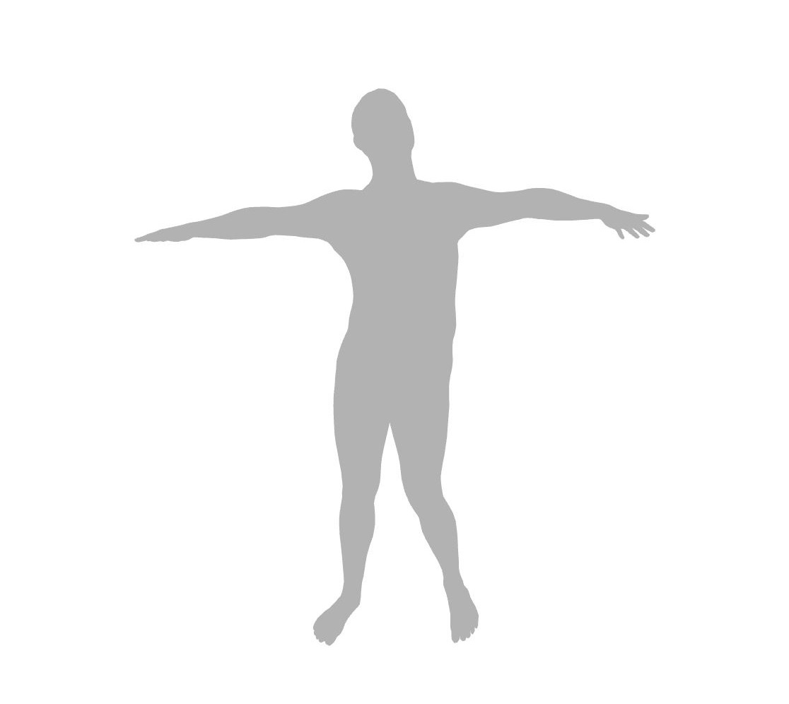

# smpl
基于numpy的smpl算法

```python
import numpy as np
import open3d as o3d
from smpl import SMPL, write_obj

model = SMPL("../models/basicmodel_m_lbs_10_207_0_v1.0.0.pkl")

pose = (np.random.rand(24, 3) - 0.5) * .4
betas = (np.random.rand(10) - 0.5) * .06
vertices, _ = model(betas, pose)
write_obj("test.obj", vertices, model.faces)

pcd = o3d.io.read_triangle_mesh("test.obj")
o3d.visualization.draw_geometries([pcd])
```

